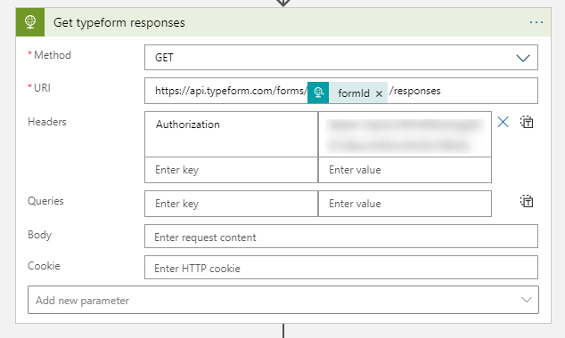
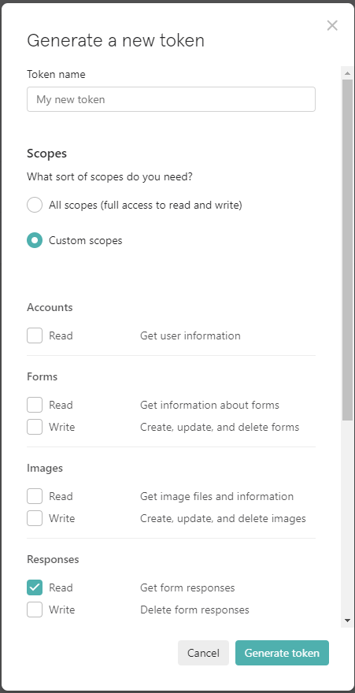
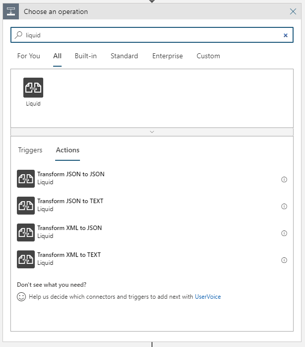
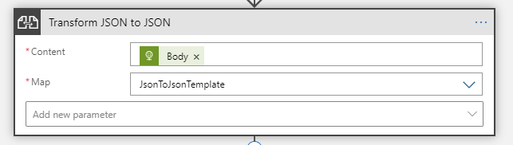
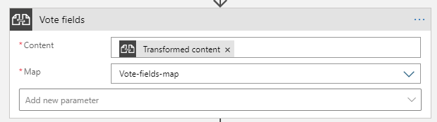

# Tworzenie formularza [typeform](https://www.typeform.com/) do głosowania bazującego na odpowiedziach udzielonych w ramach innego formularza

## W tym manualu znajdziesz informacje

- jak wykorzystać szablony Liquid w Logic App
- jak pobrać odpowiedzi udzielone do formularza typeform

### Trigger Http

Tworzymy nowy Logic App z triggerem Http w którym oczekujemy na wejściu `formId` formularza z którego będziemy pobierać odpowiedzi, tytuł nowego formularza oraz informacje umieszczane na pierwszym stronie formularza:

```json
{
	"formId": "gsmgXXSu",
    "title": "Głosowanie na sesje na 42 spotkanie Microsoft Azure User Group Poland",
	"welcome-screen-details": "Wybór należy do Ciebie!\nGłosowanie na sesje podczas 42 spotkania Microsoft Azure User Group Poland\n\nData: 09 września od 18:00\nMiejsce: Online"
}
```

Treść tego jsona możemy wykorzstać to wygenerowania schematu oczekiwanego jsona dla triggera. Lub wykorzystać poniższy.

```json
{
    "properties": {
        "formId": {
            "type": "string"
        },
        "title": {
            "type": "string"
        },
        "welcome-screen-details": {
            "type": "string"
        }
    },
    "type": "object"
}
```

### Pobranie odpowiedzi z formularza typeform

Aby pobrać odpowiedzi z formularza należy wywołać zapytanie HTTP GET na adres  `https://api.typeform.com/forms/<formId>/responses` z wykorzystaniem zadania `HTTP - Choose a REST API to invoke` gdzie ustawiamy:



- `Method` na `GET`
- `URI` na `https://api.typeform.com/forms/<formId>/responses` gdzie 'formId` pobieramy z triggera
- nagłówek `Authorization` na `Bearer <personal-token>` - token musi mieć `Read responses` scope 




### Ekstrakcja danych z odpowiedzi

W tym kroku wykorzystamy szablon [Liquid](https://github.com/dotliquid/dotliquid) aby wydzielić dane których potrzebujemy do zbudowania formularza dla głosowania. A są to:

- imię i nazwisko
- czas trwania sesji
- poziom sesji
- tytuł sesji
- opis sesji

Aby wykorzystać szablon Liquid w Logic apps nalezy dodać dodać go do `Integration Acount`. Szczegółowy opis znajduje się [tutaj](https://docs.microsoft.com/en-us/azure/logic-apps/logic-apps-enterprise-integration-liquid-transform#upload-the-template).

Kiedy szablon jest już wgrany sama konfiguracja zadania Liquid jest bardzo prosta. Z zadań Liquid wybieramy `Tranform JSON to JSON`a następnie wpisujemy jako Content body z zadania w którym pobraliśmy odpowiedzi, a jako Map wskazujemy wcześniej wgrany plik. Sam szablon wygląda następująco:



```json
{
'papers' : [

{
	'submitted_at': '{{item.submitted_at}}',
	'landed_at': '{{item.landed_at}}',
	
		
		  
		     'author': '{{answer.text}}',
		  
		     'duration': '{{answer.choice.label}}',
		  
		     'level': '{{answer.choice.label}}'
		  
		     'title': '{{answer.text}}',
		  
		     'description': '{{answer.text}}',
		
	
},

]
}
```




Pisząc szablon na względzie że w Logic Apps dane wejściowe trafiają do właściwości content i dlatego należy w szabloni użyć `content.items` zamiast `items`, co ma znaczenie prze debugowaniu szablonu lokalnie. Podanto w szablonie korzystam z apostrofu zamiast cudzysłowia, ponieważ w przypadku tego drugiego występuje błąd przy przetwarzaniu danych wejściowych jeśli w ich treści znajduje się cudzysłów.

### Budowa treści formularza w opraciu o dane pozyskane z odpowiedzi

W tym kroku również posłużymy się szablonem Liquid (zadanie `Tranform JSON to JSON`), tak więc podobnie jak wcześniej należy wgrać go przez `Integration Account`. W szablonie mapujemy każdy rekrod z kolekcji do indywidualnej strony na której wyświetlamy informacje o sesji, oraz do strony na której głosujemy na wybrane sesje.

```json
{
{
'fields': [
    {
        "title": "Za chwilę zapoznasz się z {{content.papers.size}} opisami sesji, a następnie otrzymasz możliwość zagłosowania na dwie z nich.",
        "ref": "d37c0f54-2427-45c3-9da8-e1a682f0042e",
        "properties": {
            "button_text": "Continue",
            "hide_marks": false
        },
        "type": "statement"
    },

    {
    'title': '*Imię i nazwisko:* {{item.author}}\n\n*Długość sesji:* {{item.duration}}\n\n*Poziom sesji:* {{item.level}}\n\n*Tytuł sesji:* {{item.title}}\n\n*Opis:* {{item.description}}',
    'ref': '{{ item.submitted_at | Date: "yyyyMMddhhmmss" }}-{{ item.landed_at | Date: "yyyyMMddhhmmss" }}',
    'properties': {
        'button_text': 'Continue',
        'hide_marks': false
    },
    'type': 'statement'
    },

    {
        'title': 'Na, które sesje głosujesz? MASZ DWA GŁOSY!',
        'ref': 'ccf7d0a3-0fd6-497b-816a-fee1542e35b0',
        'properties': {
            'description': 'Wybierz mądrze!',
            'randomize': true,
            'allow_multiple_selection': true,
            'allow_other_choice': false,
            'vertical_alignment': true,
            'choices': [
            
                
                {
                    'ref': '{{ item.landed_at | Date: "yyyyMMddhhmmss" }}-{{ item.submitted_at | Date: "yyyyMMddhhmmss" }}',
                    'label': '{{item.title}} - {{item.author}}, {{item.duration}}, poziom {{item.level}}'
                }
                
                {
                    'ref': '{{ item.landed_at | Date: "yyyyMMddhhmmss" }}-{{ item.submitted_at | Date: "yyyyMMddhhmmss" }}',
                    'label': '{{item.title}} - {{item.author}}, {{item.duration}}, poziom {{item.level}}'
                },
                
            
            ]
        },
        `validations`: {
            `required`: true,
            `min_selection`: 1,
            `max_selection`: 2
        },
        `type`: `multiple_choice`
    }
]
}
```



### Stworzenie formularza

W ostatnim kroku tworzymy formularz wykorzystując wcześniej utworzony json:

``` json
{
  "fields": @{body('Vote_fields')['fields']},
  "settings": {
    "are_uploads_public": false,
    "is_public": true,
    "is_trial": false,
    "language": "pl",
    "meta": {
      "allow_indexing": false
    },
    "progress_bar": "proportion",
    "show_progress_bar": true,
    "show_typeform_branding": true
  },
  "thankyou_screens": [
    {
      "attachment": {
        "href": "https://images.typeform.com/images/5wiGh2PYKXyW",
        "properties": {},
        "type": "image"
      },
      "properties": {
        "button_mode": "reload",
        "button_text": "again",
        "share_icons": false,
        "show_button": false
      },
      "ref": "c1ad6960-d547-48c2-91bc-ad2c97005bdb",
      "title": "Dzięki!\n\nDo zobaczenia na spotkaniu!\n\nPrzy okazji sprawdź nasze nowe miejsce do dyskusji zamiast grupy na FB 😎⬇️\n\n[*https://github.com/AzureCommunityPL/group/discussions*](https://github.com/AzureCommunityPL/group/discussions)"
    },
    {
      "properties": {
        "share_icons": false,
        "show_button": false
      },
      "ref": "default_tys",
      "title": "Udało się! Twoje informacje zostały przesłane."
    }
  ],
  "theme": {
    "href": "https://api.typeform.com/themes/qHWOQ7"
  },
  "title": "@{triggerBody()?['title']}",
  "type": "form",
  "welcome_screens": [
    {
      "attachment": {
        "href": "https://images.typeform.com/images/8ZTgZWCqn7eA",
        "properties": {},
        "type": "image"
      },
      "properties": {
        "button_text": "Start",
        "show_button": true
      },
      "ref": "290bb413-4f1a-4dba-9d53-48e44ce76403",
      "title": "@{triggerBody()?['welcome-screen-details']}"
    }
  ],
  "workspace": {
    "href": "https://api.typeform.com/workspaces/k9Jbqi"
  }
}
```

w body tym przekazujemy

- pola utworzone w poprzednim kroku - `"fields": @{body('Vote_fields')['fields']},`
- treść ekranu powidatlnego - '"title": "@{triggerBody()?['welcome-screen-details']}"'
- tytuł formularza - '"title": "@{triggerBody()?['title']}",'

Sam sposób tworzenia formularza znajduje się [tutaj](create-form-in-typeform.md).