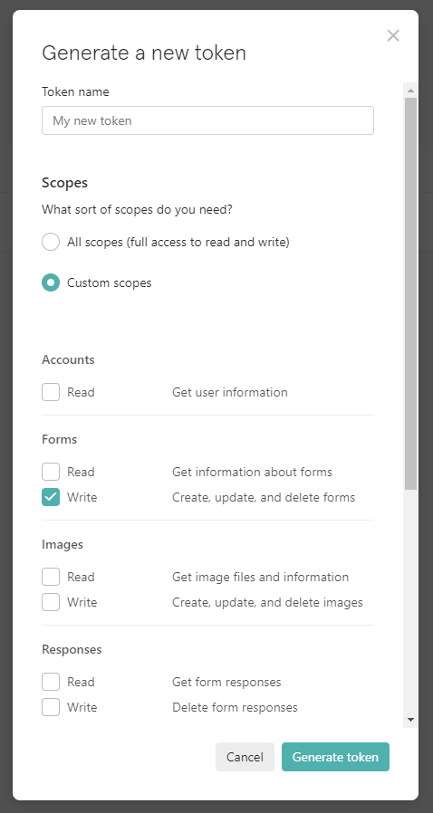
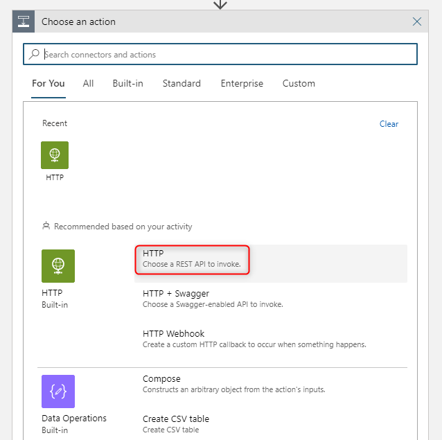
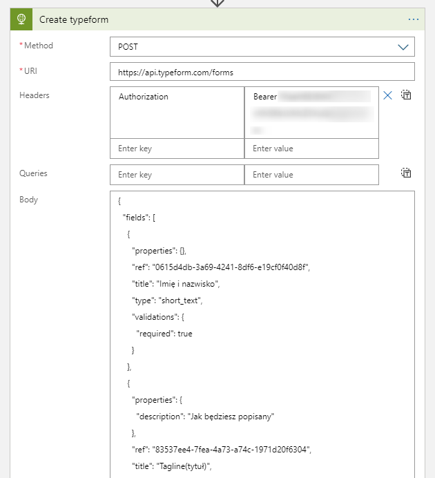

# Tworzenie formularza [typeform](https://www.typeform.com/) za pomocą Logic Apps

Aby stworzyć formularz najpierw należy przygotować jego [definicję](https://developer.typeform.com/create/reference/create-form/) w postaci pliku json. Najprostszą metodą jest pobranie definicji istniejącego formularza wykonując zapytanie `GET` pod adres `https://api.typeform.com/forms/<formId>` gdzie w miejscu `<formId>` należy podać identyfikator formularza. Z tak pobranej definicji usuwamy pola `id`.

Kolejnym krokiem jest wygenerowanie tokena z poziomu konta użytkownika w zakładce `Personal tokens` umożliwiającego tworzenie formularzy:



Mając wykonane te czynności możemy przejść do częsci zasadniczej czyli wywołania `HTTP POST` na adres `https://api.typeform.com/forms` z wykorzystaniem zadania `HTTP - Choose a REST API to invoke`



Po wybraniu zadania ustawiamy:

- `Method` na `POST`
- `URI` na `https://api.typeform.com/forms`
- nagłówek `Authorization` na `Bearer <personal-token>`,
- oraz body w którym umieszczamy wcześniej przygotowaną definicję formularza.



Przykładowa definicja formularza CFP grupy wygląda następująca:

```json
{
  "fields": [
    {
      "properties": {},
      "ref": "0615d4db-3a69-4241-8df6-e19cf0f40d8f",
      "title": "Imię i nazwisko",
      "type": "short_text",
      "validations": {
        "required": true
      }
    },
    {
      "properties": {
        "description": "Jak będziesz popisany"
      },
      "ref": "83537ee4-7fea-4a73-a74c-1971d20f6304",
      "title": "Tagline(tytuł)",
      "type": "short_text",
      "validations": {
        "required": true
      }
    },
    {
      "properties": {},
      "ref": "6ccc0676-af91-4dd7-8413-953c2a58d426",
      "title": "Email",
      "type": "email",
      "validations": {
        "required": true
      }
    },
    {
      "properties": {
        "default_country_code": "PL"
      },
      "ref": "ae867632-2cb5-4ee8-ad85-a115f4b00f69",
      "title": "Telefon kontaktowy",
      "type": "phone_number",
      "validations": {
        "required": true
      }
    },
    {
      "properties": {},
      "ref": "6eea5984-f273-4e8a-9164-825389cba877",
      "title": "Bio",
      "type": "long_text",
      "validations": {
        "required": true
      }
    },
    {
      "properties": {},
      "ref": "80d0695d-9b6b-4443-a1b2-10c4bc882c0b",
      "title": "Twój LinkedIn",
      "type": "website",
      "validations": {
        "required": false
      }
    },
    {
      "properties": {},
      "ref": "551407f3-449b-4e89-85dd-a205e9bc62f5",
      "title": "Twój Twitter",
      "type": "website",
      "validations": {
        "required": false
      }
    },
    {
      "properties": {},
      "ref": "5b82571a-0dbc-45b4-bbd0-75e9ef6acc28",
      "title": "Inna Twoja strona",
      "type": "website",
      "validations": {
        "required": false
      }
    },
    {
      "properties": {
        "description": "Jakby się dało, to w proporcjach 1:1 ;)"
      },
      "ref": "f72cf5e8-fa0a-41d6-a270-331956d43df7",
      "title": "Zdjęcie profilowe",
      "type": "file_upload",
      "validations": {
        "required": true
      }
    },
    {
      "properties": {},
      "ref": "6de7c0f9-e951-45ba-98a2-fb9cec9848cf",
      "title": "Tytuł sesji",
      "type": "short_text",
      "validations": {
        "required": true
      }
    },
    {
      "properties": {},
      "ref": "3a5a2015-ef95-4f6b-9968-04b2e7fa9d47",
      "title": "Krótki opis sesji",
      "type": "long_text",
      "validations": {
        "required": true
      }
    },
    {
      "properties": {
        "allow_multiple_selection": false,
        "allow_other_choice": false,
        "choices": [
          {
            "label": "15 min",
            "ref": "d66f9c12-4474-421f-bdf0-79abed2a3fca"
          },
          {
            "label": "30 min",
            "ref": "9cb59522-eacc-4441-b12b-2c646d4df67a"
          },
          {
            "label": "45 min",
            "ref": "e2dd3bce-dbf8-455b-88dc-0a685274187e"
          },
          {
            "label": "60 min",
            "ref": "c6c3fa55-ef07-40ee-bb68-01e5522c9e66"
          }
        ],
        "randomize": false,
        "vertical_alignment": true
      },
      "ref": "79983597-68cb-491b-87ba-c3277b93c284",
      "title": "Długość sesji",
      "type": "multiple_choice",
      "validations": {
        "required": true
      }
    },
    {
      "properties": {
        "allow_multiple_selection": false,
        "allow_other_choice": false,
        "choices": [
          {
            "label": "200",
            "ref": "fa8745f1-1677-4c8a-b3a8-bd54d34f093d"
          },
          {
            "label": "300",
            "ref": "3057b898-66db-4c39-9f0a-9e90da15ad81"
          },
          {
            "label": "400",
            "ref": "5c8a8295-45ec-4f71-9001-b5d37ad8db34"
          }
        ],
        "description": "- 200 - Intermediate material. Assumes 100-level knowledge and provides specific details about the topic.\n\n- 300 - Advanced material. Assumes 200-level knowledge, in-depth understanding of features in a real-world environment, and strong coding skills. Provides a detailed technical overview of a subset of product/technology features, covering architecture, performance, migration, deployment, and development.\n\n- 400 - Expert material. Assumes a deep level of technical knowledge and experience and a detailed, thorough understanding of topic. Provides expert-to-expert interaction and coverage of specialized topics.",
        "randomize": false,
        "vertical_alignment": true
      },
      "ref": "10e2a2cf-28d0-4bec-84af-da5e9126ba15",
      "title": "Poziom sesji",
      "type": "multiple_choice",
      "validations": {
        "required": true
      }
    }
  ],
  "settings": {
    "are_uploads_public": false,
    "is_public": true,
    "is_trial": false,
    "language": "pl",
    "meta": {
      "allow_indexing": false
    },
    "progress_bar": "proportion",
    "show_progress_bar": true,
    "show_typeform_branding": true
  },
  "thankyou_screens": [
    {
      "attachment": {
        "href": "https://images.typeform.com/images/rwHFbTuxH9ne",
        "properties": {},
        "type": "image"
      },
      "properties": {
        "button_mode": "reload",
        "button_text": "again",
        "share_icons": false,
        "show_button": false
      },
      "ref": "103b1ee2-9f54-4bc8-b800-953c865f03e3",
      "title": "Dzięki!\n\nNa grupie odbędzie się głosowanie na sesje!"
    },
    {
      "properties": {
        "share_icons": false,
        "show_button": false
      },
      "ref": "default_tys",
      "title": "Udało się! Twoje informacje zostały przesłane."
    }
  ],
  "theme": {
    "href": "https://api.typeform.com/themes/rqYVKG"
  },
  "title": "@{triggerBody()?['title']}",
  "type": "form",
  "welcome_screens": [
    {
      "properties": {
        "button_text": "Start",
        "show_button": true
      },
      "ref": "1664a2c2-2674-4db9-8786-f48880e1cd9a",
      "title": "@{triggerBody()?['welcome-screen-details']}"
    }
  ],
  "workspace": {
    "href": "https://api.typeform.com/workspaces/DEwVv8"
  }
}
```

W definicji tej znajdują się dwa parametry dynamicznie ustawiane po stronie Log Apps. Są to:

- `"title": "@{triggerBody()?['title']}",`
- `"welcome_screens.title": "@{triggerBody()?['welcome-screen-details']}"`

których to wartości mogą wyglądać tak: `CFP - [ONLINE] 43 spotkanie Microsoft Azure User Group Poland` i `Zgłoszenia sesji na 43 spotkanie Microsoft Azure User Group Poland\n\nData: 09 października od 18:00\nMiejsce: Online` odpowiednio, a są przekazywane jako parametry wywołania Logic Apps.