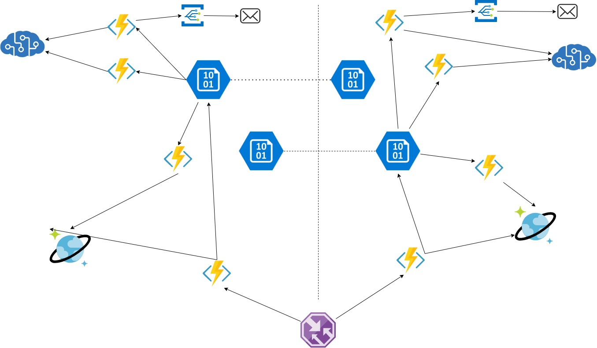

# #azure-solutions-architect Review proposed solutions

Date: 2020-07-02

[Add to calendar](https://evt.mx/KuVfnCVp)

[Meeting link](https://teams.microsoft.com/l/meetup-join/19%3ameeting_MGNjMTU5MTktN2QxMi00YTRhLThkYmUtYzZkZTM0MGUyYjY5%40thread.v2/0?context=%7b%22Tid%22%3a%22cc58971a-0481-4ec0-bf8d-bb2e265db003%22%2c%22Oid%22%3a%22f907c950-2a9a-4012-b163-af67be63b5d6%22%7d)

[Recording](https://youtu.be/2H8VoSQAw1c)

# Agenda

1. Review przygotowany rozwiązań.
2. Jak przygotowany projekt przełożyć na stawiane przez biznes SLA.
3. Jak dobrze przełożyć [Overview of the reliability pillar](https://docs.microsoft.com/en-us/azure/architecture/framework/resiliency/overview) na nasz projekt architektury?
4. Q&A.

# Discussion

## Review projektu architektury

Zadanie dla was to zaprojektować usługę, do której będą trafiać zdjęcia współdzielone przez kilka systemów.

Założenia:
- Usługa wspólna dla innych systemów
- Usługa musi być redundantna pomiędzy regionami (najlepiej active-active)
- Zawartość zdjęcia musi być automatycznie tagowana/opisywana
- Usługa musi pozwalać na wgranie i pobranie bezpośrednio zdjęć (najlepiej 2 – 3 call rest z perspektywy aplikacji klienckiej)
- Usługa musi puszczać notyfikację, że nowe zdjęcie zostało wgrane, jest otagowane itp.
- Jeśli coś będzie nie tak z zawartością zdjęcia (zwartość +18) powinna iść notyfikacja do działu prawnego/ compliance
- Usługa musi umożliwiać na wyszukanie wszystkich zdjęć po użytkowniku, systemie, tagach, w zakresie czasu
- Jeśli mam ID zdjęcia to api musi zwracać url z bezpośrednim dostępem do zdjęcia
- Skala to 100k zdjęć miesięcznie zapisywanych, odczyt 2M razy, średni rozmiar 1 mb
- Zdjęcie jest czytane najczęściej przez pierwsze 45 dni
- Ile będzie kosztować system na przestrzeni 1, 12 i 24 miesięcy?

Poglądowy schemat architektury:

## Q&A
