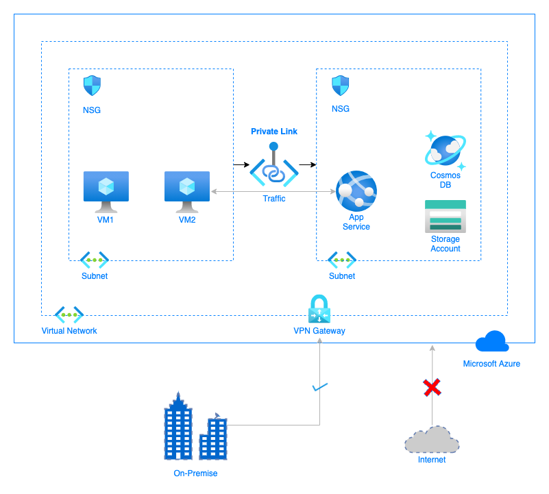
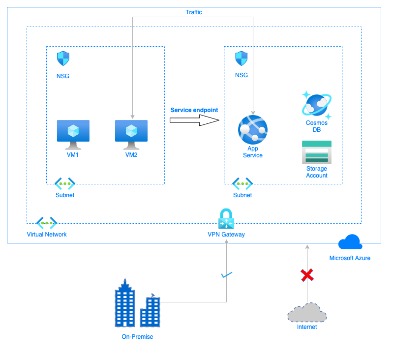

# #azure-solutions-architect zabezpieczenie komunikacji pomiedzy on-prem a Azure

Date: 2020-10-22

[Add to calendar](https://evt.mx/nLArx0BI)

[Meeting link](https://teams.microsoft.com/l/meetup-join/19%3ameeting_MGYzOTZjYWYtNDliNi00NzJiLWFkNWEtYjRhMzJhMGFiMzcw%40thread.v2/0?context=%7b%22Tid%22%3a%22ef60a5a4-900c-4789-89cd-0c42f28ef541%22%2c%22Oid%22%3a%22843f36ea-2af5-4be3-a168-6b8fd3acd1b3%22%7d)

[Recording](https://youtu.be/H2Wf1lo-3ts)

# Agenda

1. Przegląd przygotowanych rozwiązań.
2. Q&A.

# Dyskusja

## Przegląd projektu architektury

### Zadanie
Firma chce zabezpieczyć komunikację sieciową pomiędzy zasobami, które są hostowane na Azure oraz zasobami uruchomionymi w sieci lokalnej firmy. Cała infrastruktura powinna być dostępna tylko z sieci firmowej, oraz w ramach podsieci dla maszyn wirtualnych. W chwili obecnej podjęta została decyzja o przeniesieniu całych maszyn wirtualnych wraz z zasobami. Zaproponowane rozwiązanie powinno uwzględnić możliwość użycia różnych zasobów Azure w przyszłości.

### Wymagania:
- dwie wersje systemu: 
1) stosunkowo bezpieczna i tania 
2) droższa ale bardziej zabezpieczona
- należy policzyć koszty rozwiązania (bez kosztów maszyn wirtualnych)
istotna jest analiza wdrożenia innych usług hostowanych na Azure w przyszłości
- nakład pracy potrzebny do wdrożenia obu rozwiązań
- sposób monitorowania / zarządzania rozwiązaniami
- analiza SLA

### Poglądowy schemat architektury:
#### Private link

#### Service endpoints

## Q&A
- miesięczny koszt rozwiązania opartego o Private Link to ok. $9. Przy załozeniu transferu inbound/outbound na poziomie 100GB, oraz wykorzystaniu jednego "link" dla usług!!!

### Linki związane z tematem
- Service enpoints: https://docs.microsoft.com/en-us/azure/virtual-network/virtual-network-service-endpoints-overview
- Private endpoint: https://docs.microsoft.com/en-us/azure/private-link/private-endpoint-overview
- Private link: https://docs.microsoft.com/en-us/azure/private-link/private-link-service-overview
- Łączenie sieci on-premises przez VPN Gateway: https://docs.microsoft.com/en-us/learn/modules/connect-on-premises-network-with-vpn-gateway
- Łączenie sieci on-premises przez ExpressRoute: https://docs.microsoft.com/en-us/learn/modules/connect-on-premises-network-with-expressroute
- NSG & Service Endpoint: https://docs.microsoft.com/en-gb/learn/modules/secure-and-isolate-with-nsg-and-service-endpoints/
- VPN Gateway + on-premises: https://docs.microsoft.com/en-gb/learn/modules/connect-on-premises-network-with-vpn-gateway/
- Architektura Hub-spoke: https://docs.microsoft.com/en-us/azure/architecture/reference-architectures/hybrid-networking/hub-spoke
- Private Link pricing: https://azure.microsoft.com/en-us/pricing/details/private-link/

### Egzaminy Microsoft:
- Azure certifications: https://query.prod.cms.rt.microsoft.com/cms/api/am/binary/RE4wyqh
- Wszystkie certyfikaty z linkami: https://query.prod.cms.rt.microsoft.com/cms/api/am/binary/RE2PjDI

### Materiały do nauki:
- Microsoft learn: https://docs.microsoft.com/en-us/learn/
- Eventy (też takie gdzie można dostać vouchery na egzaminy): https://events.microsoft.com/?timeperiod=next30Days&isSharedInLocalViewMode=true&country=Poland&language=English
- Wtorki z security: https://info.microsoft.com/CE-SCRTY-CATALOG-FY21-07Jul-29-WtorkizSecurity-SRDEM32279_CatalogDisplayPage.html
- Czwartki z Azure: https://info.microsoft.com/CE-AzureINFRA-CATALOG-FY20-04Apr-28-ThursdayswithAzure-SRDEM21201_CatalogDisplayPage.html
- Pluralsight + Azure: https://www.pluralsight.com/partners/microsoft/azure
- Kurs AZ-900 Adama (podstawy Azure): https://www.youtube.com/channel/UCdmEIMC3LBil4o0tjaTbj0w